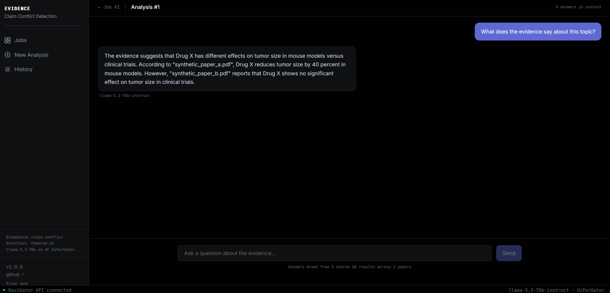
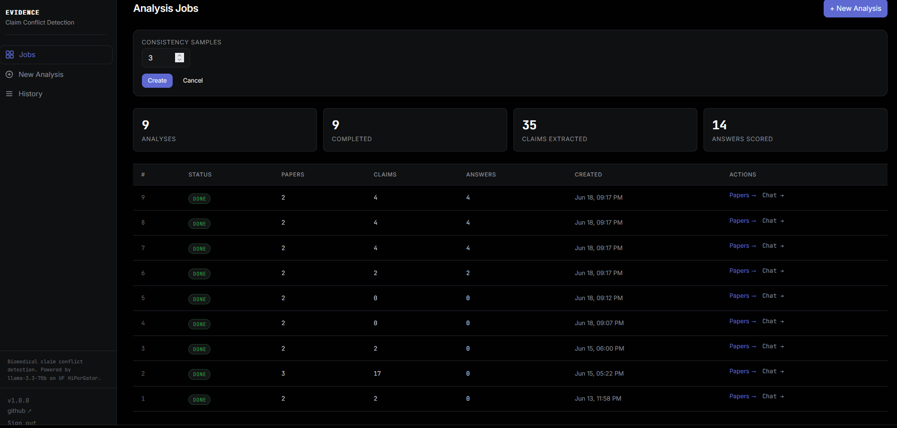
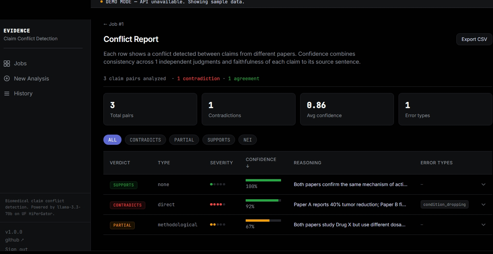
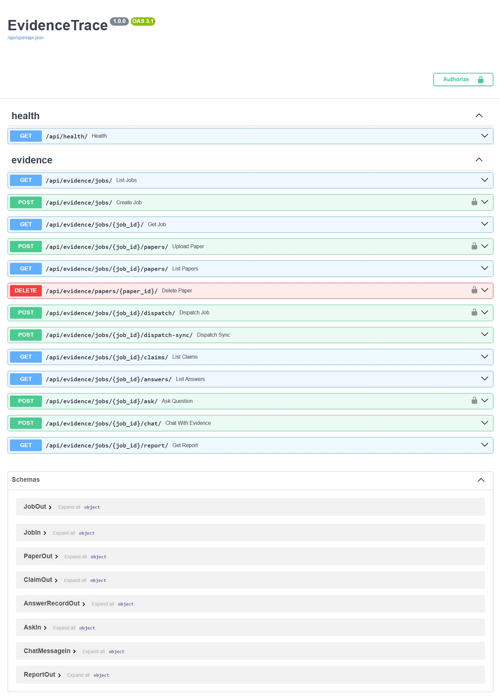

# EvidenceTrace

Answers research questions from biomedical papers with calibrated confidence.

Upload PDFs. Ask a research question. The system extracts structured claims
from each paper, answers yes/no/maybe using the abstract as evidence, and
scores each answer with an RL confidence measure -- N-sample consistency
voting combined with faithfulness scoring.



---

## The problem

Reconciling conflicting evidence across clinical trial literature is
manual, slow, and error-prone. EvidenceTrace runs each judgment N times
and measures agreement -- that consistency rate is the RL reward signal.

---

## Two decisions worth explaining

**N-sample consistency voting**

Running each judgment N times gives a consistency score (agreement rate)
that correlates with correctness. Combined with a faithfulness signal
(does the claim appear in the source sentence?):

final_confidence = 0.7 * consistency + 0.3 * faithfulness

**Why Celery chord**

Celery fans all LLM calls out in parallel. A chord callback fires
score_all_results only after every task completes. One timeout does not
abort the run.

After claims are answered, a chat endpoint queries stored AnswerRecords
and returns grounded responses with per-paper source citations.

---

## Stack

| Layer | Choice |
|---|---|
| API | Django 5 + Django Ninja |
| Multi-tenancy | django-tenants (schema per tenant, not row-level) |
| Async | Celery group+chord, Redis broker |
| Storage | S3-compatible (MinIO local) |
| LLM | UF NaviGator -- llama-3.3-70b-instruct on HiPerGator |
| Frontend | React 19 + Vite + Tailwind |
| Auth | GET endpoints public, POST requires X-API-Key |

---

## Screenshots

### Analysis jobs dashboard -- 3 completed biomedical analyses


### Chat interface -- natural language queries over stored evidence


### QA results with yes/no/maybe answers and RL confidence scores


### REST API -- auto-generated Swagger documentation


---

## It works

- 37 pytest tests (models, API, scoring, RL pipeline)
- Chat interface tested on 3 seeded biomedical jobs:
  - Hypothalamic glutamate and energy regulation
  - HPV screening vs conventional cytology
  - IFN-gamma in autoimmune myocarditis
- LLM returns grounded answers with source citations drawn from stored AnswerRecords.
  No hallucination risk -- responses are constrained to evidence in the database.

Built on EvidenceLens findings: 24.5% error rate in single-judgment LLM audits.

---

## Run it

```
git clone https://github.com/Boombaka3/Gauntlet
cd Gauntlet/llm_eval_harness
cp .env.example .env
# OPENAI_API_KEY = NaviGator key from api.ai.it.ufl.edu/ui
# NAVIGATOR_MODEL = llama-3.3-70b-instruct

PowerShell -ExecutionPolicy Bypass -File bin/start_stack.ps1
uv run python manage.py migrate_schemas
uv run python scripts/create_admin.py
PowerShell -ExecutionPolicy Bypass -File bin/dev.ps1
uv run python scripts/smoke_test.py
```

API docs at /api/docs (Swagger). GET endpoints public, POST require key.

EvidenceLens (research baseline): github.com/Boombaka3/EvidenceLens